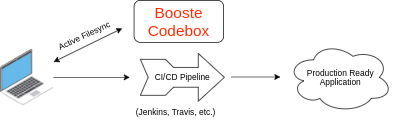
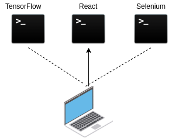

# Booste CLI 
The Booste CLI (command line interface) makes remote development as easy as local. 
Run code in personalized environments on the cloud, rather than on the local hardware.
Booste remote evironments are easily be shared across your team, eliminating dependency issues, platform conflicts, and compute restrictions of local hardware.

**Booste has a number of potential use cases.
A few possible use cases:**

### 1. Before CI/CD Pipeline

You can use a codebox to make sure that your team's environments are in sync before you put it through a CI/CD pipeline
so you can avoid frustrating compatibility issues with your code.



### 2. Speeding up the Docker workflow

Jump into an environment on demand, without sending Docker files around.



### 3. Offload GPU Processing

Don't have a system you can do GPU intensive work on? 

Or are you having trouble with batch processing and compilation of lengthy projects?

Booste codeboxes can be used to do the heavy lifting. Paid plans provide you with more processing power
than $2000+ laptops, saving time and money.


# Terminology 

### Codebox
Codebox refers to the remote environment in which teams run their code.

At the current state of Booste, each codebox is an isolated server instance, shared only by other verified team members in that codebox.
The environment, including packages and interpreters, are shared by the team. Each team member has their own repo, sitting side-by-side in the codebox.

### Active Filesync
Active filesync is a background process that syncronizes the codebox files to your local Booste directory.

For macOS and Linux users, the synced directory is found at the path /home/{your-user-name}/Booste.

While filesync is running, any files created, modified, or deleted within this local directory will be automatically uploaded to the codebox. The sync happens in less than one second for most text-based file saves. 

Larger repos placed in the filesync directory will slow the sync, so be sure to only include source code and ignore dependencies. Virtual environments, Docker images, packages, and interpreters should be installed via the activate command, not uploaded through filesync.

Notes on current CLI version:
 - Filesync pushes code from local to remote, but does not yet pull. Files generated by your process will exist on the remote side, but not locally.
 - Filesync starts only when the first one-line-command or "activate" command is ran. It will remain live until remote or local shutdown.

### Local ID 
A simple ID, which you'll use to specify that codebox for various Booste commands.

### ID 
The unique ID of that codebox in the Booste system, to be shared with team members who wish to join that codebox, with the command "join".

### State 
The running state of the server hosting the codebox. The state may be changed with the "start" and "stop" commands.

### Name 
The name given to the codebox by its creator.


# Installation

Run this command in your terminal to install the CLI tool via [pip](https://pip.pypa.io/en/stable/):
```bash
pip3 install booste-cli
```
We recommend using the most recent version.

### Supported Tech Stacks
As of release 0.1.17

### Supported:
- Any<sub>1</sub> interpreted language, such as Python, Node.js, bash.
- Any<sub>1</sub> compiled language<sub>2</sub>, such as C, C++, Java, Go, Rust.
- Web servers running through ports 3000, or 8000-8100.

1) A member of the codebox may need to install the language interpreter/compiler into the codebox, via the activate command.
2) The compilation process runs in the codebox, and the resulting compiled file will be created in the codebox. 
   Remote files do not currently sync down to local, so the compiled file will not exist locally.
   When typing a one-liner, the path to the compiled file path will not be recognized locally, but it does indeed exist remotely and will run.

### Not Supported:
Apps with GUI based engines.
- Desktop GUI, such as Electron
- AR/VR
- Game engines, such as Unity


# CLI Usage

### Get Help
```bash
booste
```
```bash
booste --help
```
Prints a documentation-like help page to the console.

### Login
```bash
booste login {optional: username}
```
Verifies your user account as valid and logs you in indefinitely.

You may pass your Booste username directly into the command, or enter it when prompted. The password entry prompt will follow. For password resets, please contact us at password.help@booste.io.

For account creation, go to www.booste.io/cli/new_user/.

### Logout
```C
booste logout
```
Logs the current active user out of the system. There may only be one logged-in account per device, and only one logged-in device per user.

### One-Line Commands
```C
booste {codebox local ID} {unix command to be ran remotely}
```
Executes the given command in the specified codebox.
For example, to run a python file in codebox #2, use:
```bash
booste 2 python3 path/to/file.py
```

If a default codebox is set, the local ID may be omitted:
```bash
booste default 2
...
...
booste python3 path/to/file.py
```

This command is meant to execute code files. It will ignore commands that do not point to an executable file.

### Codebox Configuration
```C
booste activate {optional: codebox local ID}
```
Connects you into the selected codebox. You are placed into an SSH session, with the ability to interact with the codebox via Unix commands. 

You may pass a codebox local ID directly into the command, or enter it when prompted.
If a default codebox is set, the local ID may be omitted.

It is through Activate that users set up the codebox environment, through tools such as pip or npm. When setting up the codebox, make sure that packages are available globally (no virtual environments or containers).

Within the activated session, you can leave the codebox by typing the command
```bash
logout
```

### List All Codeboxes
```bash
booste list
```
Lists the codeboxes to which you have access.

### Set A Default Codebox
```bash
booste default {optional: codebox local ID / "clear"}
```
Saves a codebox as the default codebox, so that local IDs do not need to be explicitly provided with each command.

You may pass a codebox local ID directly into the command, or enter it when prompted.
If "clear" is passed in rather than a local ID, any pre-existing default codebox will be removed.

### Start A Codebox
```C
booste start {optional: codebox local ID}
```
Starts the server hosting your codebox.

You may pass a codebox local ID directly into the command, or enter it when prompted.
If a default codebox is set, the local ID may be omitted.

The codebox will remain running until either the remote or local machines are shut down.

This will not activate a codebox.

### Stop A Codebox
```C
booste stop {optional: codebox local ID}
```
Booste stop will stop the server hosting your codebox.

You may pass a codebox local ID directly into the command, or enter it when prompted.
If a default codebox is set, the local ID may be omitted.

### Restart A Codebox
```C
booste restart {optional: codebox local ID}
```
Booste stop will stop and then restart the server hosting your codebox.

You may pass a codebox local ID directly into the command, or enter it when prompted.
If a default codebox is set, the local ID may be omitted.

### Create A New Codebox
```bash
booste new {optional: codebox name}
```
Creates a new codebox and joins you into it as the first team member.

You may pass the desired codebox name directly into the command, or enter it when prompted. A password entry and password re-entry prompt will follow.

Codebox names are not required to be unique, though for clarity we recommend avoiding duplicates with your team.

Codeboxes are password protected, and this password is needed for others to join your codebox. Be sure to save it. For codebox password resets, please contact us at password.help@booste.io.

### Join An Existing Codebox
```bash
booste join {optional: codebox full ID}
```
Adds you as a member into an existing codebox.

You may pass the desired codebox id directly into the command, or enter it when prompted. A password entry prompt will follow.

The full codebox "ID" and the password must be given to you by a team member, to ensure security.

### See Codebox Information
```bash
booste info {optional: codebox local ID}
```
Prints detailed information about the codebox, including:
    Name
    Unique ID
    Owner - The user who created it
    Members
    Instance Type - The hosting virtual machine, in [AWS EC2 terminology](https://aws.amazon.com/ec2/instance-types/)
    Server Region
    Lifespan - The time that a codebox remains live before being automatically stopped. The default is 4 hrs.
    State
    IP - The public IP, used to access web servers through ports 3000 or 8000-8100

You may pass a codebox local ID directly into the command, or enter it when prompted.
If a default codebox is set, the local ID may be omitted.

### Leave a Codebox
```bash
booste leave {optional: codebox local ID}
```
Removes you as a member from a codebox that you previously joined.

You may pass a codebox local ID directly into the command, or enter it when prompted.
If a default codebox is set, the local ID may be omitted.

You are free to re-join the codebox at any time with the "join" command as it does not stop the the server hosting your codebox.

To leave a codebox you created, use Delete.

### Permanently Delete a Codebox
```bash
booste delete {optional: codebox local ID}
```
Removes all members from a codebox that you previously created, and deletes it.

You may pass a codebox local ID directly into the command, or enter it when prompted.
If a default codebox is set, the local ID may be omitted.

You cannot revive a deleted codebox.

### Report a Bug
```bash
booste report
```
Files a bug report. You will be prompted to explain the bug.
If bugs become preventative, try running "reset" (below)

### Ask a Question 
```bash
booste ask
```
Texts your question directly to a founder's cell phone. You will be prompted to input your question and reply-to phone number.

### Reset the Client (bug cleaning)
```bash
booste reset
```
Clears caches, closes hanging ssh tunnels, and kills filesync.
Use if the one-line commands or "activate" command throw errors or hang.
Use if filesync appears to not be running; it will force a restart.


## License 

[View EULA (End-User License Agreement)](Booste_EULA.pdf)
